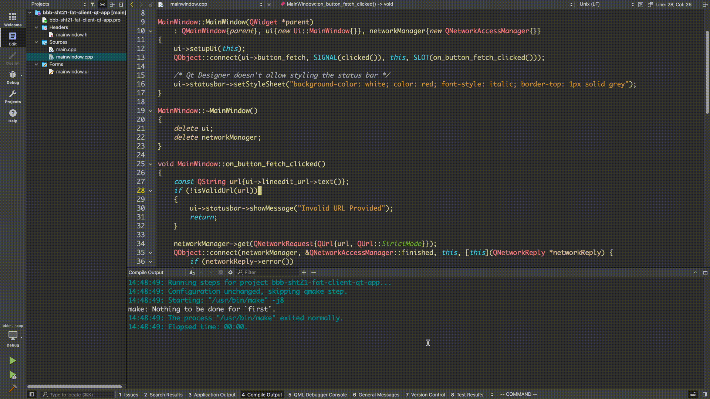

## Fat-Client Qt App

A tiny desktop application that collects data from a [sensor web](https://github.com/dehre/bbb-sht21-multithreaded-http-server) and displays it to the user.  
The software has been [built with Qt 6.4](https://www.qt.io/product/qt6).



## Motivation

Recent software trends are moving toward thin-client browser-based architectures, with the assumption that servers are deployed on powerful machines and clients may be quite outdated (e.g. old mobile device).

When interacting with an embedded system, however, the situation is most likely flipped.  
It makes sense, in this case, to flash a tiny and efficient executable to the microcontroller, a [BeagleBone Black](https://beagleboard.org/black), and build a fat-client desktop (or mobile) application for the client.

Here are some of the advantages:

* lower computing and energy requirements for the MCU, which directly affect prices of production and battery life;
* assuming everything the embedded device does is responding with JSON data, it's less likely that its software needs to be updated;
* the same remote sensor can serve data to multiple clients concurrently;
* the user interface and complex functionality are shifted to the client; and
* the client software can easily be tailored to specific use cases (e.g. desktop vs mobile, or special customer requirements).

This project, [along with its sibling](https://github.com/dehre/bbb-sht21-multithreaded-http-server), is aimed at exploring such approach.

## Building & Running

To build:

```sh
mkdir build
cd build
qmake .. CONFIG+=debug # or `CONFIG+=release`
make -j8 TARGET=app    # or `TARGET=someNameForTheExecutable`
```

To run:

```sh
./build/app
```
